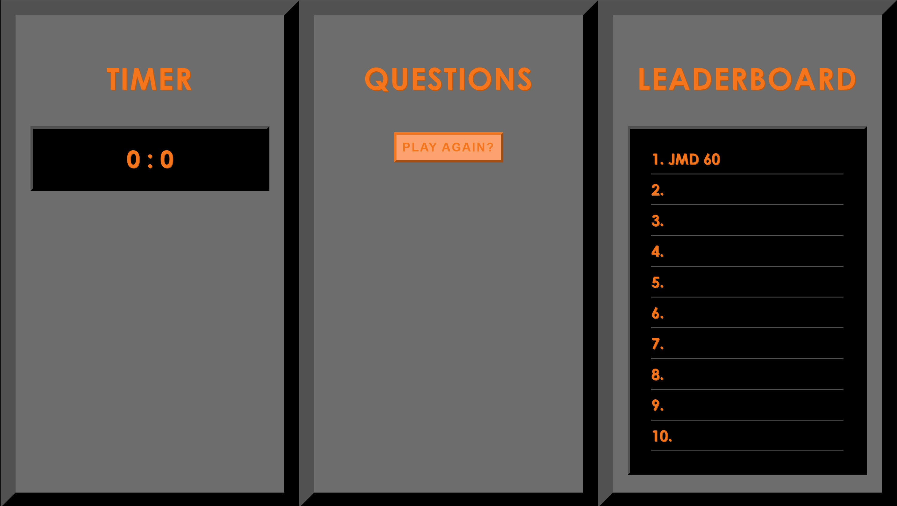

# Code Quiz

## Objective
The objective of this assignment was to create a quick code quiz with knowledge of JavaScript fundamentals.

## Approach
My approach was to first draw out how I wanted my user interface to look and once that was accomplished in HTML and CSS, the step by step plan for JavaScript was drawn out. As I was new to Javascript, it took a lot of trial and error to start up the page accordingly and get the questions to loop. I tried to problem solve as I went on and tackle each sequence as a single task that would all come together at the end.

## Outcome
The outcome is not as successful as I'd hoped for. I was able to get the timer to work, the questions to cycle, and the correct score to log but after all of that, my next task of saving the data through JSON and then sorting by score was not achieved.

## Reflection
I think next time I will do more brainstorming and pre-planning to create the most simplified and sustainable way to code this. My approach on the questions would be different as I know I would only create one div element and put the questions and their answers in through JavaScript. There was a lot to be learned with this.

## Final Product
[Click here to view](https://jessicamdittrich.github.io/CHG-JD052522)